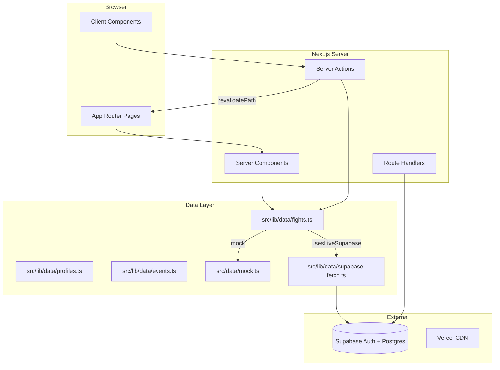
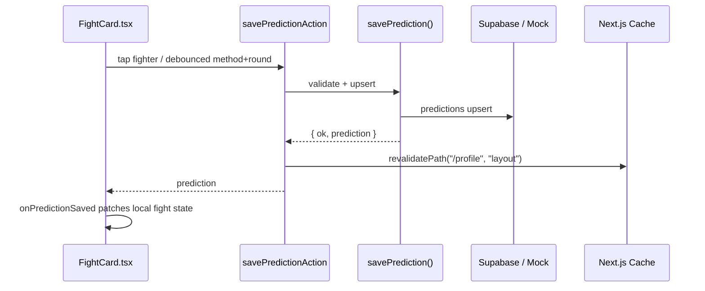

# PickFist Code Bible

**Last updated:** June 2026  
**Production:** [pickfist.com](https://pickfist.com)  
**Repo:** `Gilganjun/pickchamp` (branch `master`)  
**Tagline:** *You Don't Know S\*\*\* About Fighting.*

---

## How to use this document (new Cursor chat)

When starting a fresh chat, tell Cursor:

> Read `docs/PICKFIST_CODE_BIBLE.md` first for full project context, then continue from where we left off.

Also useful companions:
- `README.md` — setup, env vars, Supabase bootstrap
- `docs/RATING_SYSTEM_IMPLEMENTATION.md` — rating formula deep dive
- `docs/ADMIN_FIGHT_CLASSIFICATION_GUIDE.md` — admin favourite fields
- `supabase/schema.sql` — database truth
- `supabase/seed_launch.sql` — launch event/fight cards

---

## 1. What PickFist is

PickFist is a **combat-sports prediction competition** for **boxing** and **MMA**. Users pick fight winners (and optionally method/round), earn **skill-based ratings**, and climb **global / boxing / MMA leaderboards**.

**It is NOT betting or gambling.** No money, no odds staking — only prediction skill and ratings.

### Core user journeys

| Journey | Route | Summary |
|---------|-------|---------|
| Make picks | `/picks` | Filter by sport + event card, tap fighters, auto-save picks |
| View profile | `/profile` | Rating, rank state, current picks, recent form, stats |
| Public profile | `/profile/[username]` | Others' profiles; open picks hidden until lock |
| Leaderboard | `/rankings` | Global / Boxing / MMA tabs |
| Browse events | `/events`, `/events/[id]` | Upcoming and settled cards |
| Auth | `/login`, `/signup` | Email/password + Google OAuth |
| Admin | `/admin/*` | Create events/fights, settle results, grade picks |

Home `/` redirects to `/picks`.

---

## 2. Tech stack

| Layer | Choice |
|-------|--------|
| Framework | **Next.js 15** App Router (`src/app/`) |
| Language | **TypeScript** |
| UI | **React 19**, **Tailwind CSS v4** |
| Backend / DB | **Supabase** (Auth + Postgres + RLS) |
| Hosting | **Vercel** (`pickfist.com`) |
| Analytics | `@vercel/analytics` in `src/app/layout.tsx` |
| Tests | **Vitest** (`npm test`) |

**Path alias:** `@/*` → `src/*`

**Layout column:** `.pickfist-content` in `globals.css` — max-width ~32rem, centered, mobile-first.

---

## 3. Runtime modes (critical)

All data/auth code branches on `usesLiveSupabase()` in `src/lib/config.ts`:

```
hasSupabaseConfig()  → valid NEXT_PUBLIC_SUPABASE_URL + ANON_KEY
usesLiveSupabase()   → production: true when config exists
                     → local dev: false UNLESS PICKFIST_USE_SUPABASE=true
```

### Mock / demo mode (default local dev)

- No login required — demo user **`fightfan42`** (`MOCK_USER_ID` in `src/data/mock.ts`)
- Data from `src/data/mock.ts` + `src/lib/mock/demoPredictionStore.ts`
- Picks can persist to `.mock-data/demo-predictions.json` (gitignored, dev only)
- Auth actions return *"Local demo mode — use /profile and /picks without logging in."*
- Middleware skips Supabase session refresh

### Live Supabase mode (production + optional local)

- Real accounts, persistent picks in `predictions` table
- `getAuthUser()` in `src/lib/auth/session.ts`
- Middleware refreshes cookies via `src/lib/supabase/middleware.ts`
- Admin writes use **service role** client (`src/lib/supabase/admin.ts`)

### Phantom dev card (local only)

When `PICKFIST_PHANTOM_CARD=true` + `NODE_ENV=development`:
- Injects fights from `.mock-data/phantom-picks-card.json` (gitignored)
- Saves to `.mock-data/phantom-predictions.json`
- Logic: `src/lib/dev/phantomPicksDev.ts`
- Fight IDs prefixed `phantom-local-`
- **Never ships to production** (guarded in code)

---

## 4. High-level architecture



### Request flow: saving a pick



**Important:** Picks page does **not** full-refetch on save. `PicksClient.handlePredictionSaved` patches `userPrediction` in React state. Full `load()` only runs when sport/card filter changes.

---

## 5. Directory map

```
src/
├── app/                      # Routes, layouts, server actions
│   ├── actions/              # auth.ts, picks.ts, rankings.ts, admin.ts
│   ├── admin/                # Admin UI (layout gated)
│   ├── auth/callback/        # OAuth callback route
│   ├── picks/                # Main picks experience
│   ├── profile/              # Own + public profiles
│   ├── rankings/             # Leaderboards
│   ├── events/               # Event browser
│   ├── login|signup|onboarding/
│   ├── layout.tsx            # Root layout + Analytics
│   ├── globals.css           # Theme, pick impact animations
│   └── middleware.ts         # Re-exports session refresh
│
├── components/
│   ├── FightCard.tsx         # Core pick UI + auto-save
│   ├── AppShell.tsx          # Page wrapper + nav
│   ├── BrandHeader.tsx       # Logo + rotating tagline
│   ├── PickFistLogo.tsx      # PNG brand mark
│   ├── LockGraphic.tsx       # Lock overlay asset
│   ├── picks/                # PicksFilterBar, PickRatingSwing, impact FX
│   ├── profile/              # Profile page sections
│   ├── auth/                 # Login/signup/OAuth UI
│   └── admin/                # Admin fight fields
│
├── lib/
│   ├── config.ts             # usesLiveSupabase(), ADMIN_EMAILS
│   ├── data/                 # fights.ts, profiles.ts, events.ts, supabase-fetch.ts
│   ├── auth/                 # session, oauth, username, admin gate
│   ├── rating/               # SCORING FORMULA — do not change casually
│   ├── grading/              # gradeFight.ts — batch grading on settle
│   ├── profile/              # display.ts, ratingTiers.ts, rankGraphics.ts
│   ├── rankings.ts           # Leaderboard eligibility + sort
│   ├── supabase/             # server/client/admin clients, mappers
│   ├── mock/                 # demoPredictionStore.ts
│   ├── dev/                  # phantomPicksDev.ts
│   ├── brand/                # subheadingPhrases.ts
│   └── datetime.ts           # All user-facing timestamps (en-GB)
│
├── data/mock.ts              # Static seed events/fights/profiles
└── types/index.ts            # Shared TS types

supabase/
├── schema.sql                # Full schema + RLS (run first)
├── seed_launch.sql           # Launch fight cards (run second)
└── migrations/             # Historical — do not re-run on fresh DB

public/
├── graphics/                 # PickfistLogo.png, Lock.png
├── ranks/                    # Rank tier PNGs
├── impact/                   # Glove punch PNGs
└── sounds/                   # Punch MP3s

docs/                         # This file + rating/admin guides
```

---

## 6. Routes reference

| Route | File | Notes |
|-------|------|-------|
| `/` | `app/page.tsx` | Redirect → `/picks` |
| `/picks` | `app/picks/page.tsx` + `PicksClient.tsx` | `dynamic = "force-dynamic"` |
| `/rankings` | `app/rankings/page.tsx` + `RankingsClient.tsx` | |
| `/events` | `app/events/page.tsx` | |
| `/events/[id]` | `app/events/[id]/page.tsx` | |
| `/profile` | `app/profile/page.tsx` | `force-dynamic`, own profile |
| `/profile/[username]` | `app/profile/[username]/page.tsx` | Public profile |
| `/login` | `app/login/page.tsx` | |
| `/signup` | `app/signup/page.tsx` | Separate forms for Google vs email |
| `/onboarding/username` | `app/onboarding/username/page.tsx` | Google users without username |
| `/auth/callback` | `app/auth/callback/route.ts` | OAuth code exchange |
| `/admin` | `app/admin/page.tsx` | Hub |
| `/admin/events` | `app/admin/events/page.tsx` | |
| `/admin/fights` | `app/admin/fights/page.tsx` | Favourite classification |
| `/admin/results` | `app/admin/results/page.tsx` | Settle + grade |

**Navigation:** `BottomNav.tsx` — Picks, Rankings, Events, Profile.

---

## 7. Authentication

### Email / password
- **Actions:** `src/app/actions/auth.ts` — `signUpAction`, `signInAction`, `signOutAction`
- Signup validates username via `src/lib/auth/username.ts`
- Profile auto-created by DB trigger `handle_new_user()` on `auth.users` insert

### Google OAuth
- `signInWithGoogleLoginAction`, `signInWithGoogleSignupAction`
- Callback: `src/app/auth/callback/route.ts` → `resolveOAuthCallbackPath()` in `src/lib/auth/oauth.ts`
- Signup flow: username stored as `pending_username` in redirect URL, applied on callback
- Login flow: users without proper username → `/onboarding/username`
- Detection: `profileNeedsUsernameOnboarding()` in `src/lib/auth/username.ts`

### Session
- Server: `createClient()` from `src/lib/supabase/server.ts` (cookies)
- Browser: `src/lib/supabase/client.ts`
- Middleware: `src/middleware.ts` → `updateSession()` only when live Supabase

### Redirect URLs (must match Supabase dashboard)
- `https://pickfist.com/auth/callback`
- `http://localhost:3000/auth/callback`

---

## 8. Data layer

### Central API: `src/lib/data/fights.ts`

| Function | Purpose |
|----------|---------|
| `getFightsForPicks(sport, userId, eventFilter)` | Active upcoming/live fights for Picks page |
| `getFightsForProfile(userId)` | All fights + relations for profile |
| `getEventsForPicks(sport, userId)` | Events with ≥1 active fight |
| `getUserPredictions(userId)` | All user predictions (+ phantom merge in dev) |
| `savePrediction(input)` | Validate → phantom/mock/Supabase upsert |

### Fight filtering: `src/lib/data/fights-utils.ts`

| Function | Purpose |
|----------|---------|
| `isActivePicksFight(fight)` | Tab `upcoming` or `live` (excludes settled) |
| `isEventPicksLocked(fights)` | **All** fights on card past lock — triggers collapsed locked UI |
| `groupFightsByEvent(fights)` | Event card sections |
| `filterFightsForPicksView()` | Sport + event filter |

### Lock state (no cron)
Derived in `src/lib/utils.ts`:
- `isFightLocked(fight)` — status locked/settled/etc. OR `lock_time <= now`
- `inferFightTab(status, lock_time)` → `upcoming` | `live` | `settled`
- `getLockCountdown(lock_time)` — UI countdown string

### Profiles: `src/lib/data/profiles.ts`
- `getCurrentUserProfile`, `getProfileByUsername`
- `getLeaderboard(tab)` — eligible users only
- `getProfileRanks(profile)` — `{ global, boxing, mma }` rank display objects

### Supabase reads: `src/lib/data/supabase-fetch.ts`
Joins via `src/lib/supabase/mappers.ts` → app types in `src/types/index.ts`

### Profile data loading (important)
Profile pages use **`getFightsForProfile()`** + **`getUserPredictions()`** — same path as picks (includes phantom dev data). After save, **`revalidatePath("/profile", "layout")`** in `savePredictionAction`.

---

## 9. Picks page (detailed)

### Files
- `src/app/picks/page.tsx` — server load initial data
- `src/app/picks/PicksClient.tsx` — client state, filters, event sections
- `src/components/FightCard.tsx` — per-fight pick UI
- `src/components/picks/PicksFilterBar.tsx` — sport + card dropdowns (default: All Sports / All Cards)
- `src/app/actions/picks.ts` — `loadPicksPageDataAction`, `savePredictionAction`

### Auto-save behavior (`FightCard.tsx`)
- **Fighter/draw tap** → immediate `savePredictionAction`
- **Method / round** → 500ms debounce (`METHOD_ROUND_SAVE_DEBOUNCE_MS`)
- Status UI: Saving / Saved ✓ / Pick updated ✓ / Couldn't save (retry)
- **No "Lock my pick" button** — removed in favor of auto-save
- Locked/settled fights: read-only panel with `LockGraphic` + saved pick line

### Locked event cards (`PicksClient.tsx` → `EventCardSection`)
When `isEventPicksLocked(cardFights)`:
1. **Never auto-expands** (even if card filter selected)
2. Badge: **"Picks Locked — Event Started"** (amber)
3. **Collapsed** by default; `LockGraphic variant="card"` centered overlay
4. User can still tap to expand and view picks

### Pick impact FX (Picks page only)
- Glove overlay: `PickImpactOverlay.tsx`, assets `/impact/Glove1.png`, `Glove2.png`
- Sound: `src/lib/audio/playPickImpactSound.ts`, `/sounds/Punch*.mp3`
- Enabled via `enablePickImpact` prop on `FightCard`

### Rating swing display (UI only — not scoring)
- `src/lib/rating/getPickPotential.ts` — potential win/loss per pick
- `src/components/picks/PickRatingSwing.tsx` — inline + summary panels
- Uses admin-set `favourite_side` + `favourite_level` on each fight

---

## 10. Profile page (detailed)

### Files
- `src/app/profile/page.tsx` — own profile (auth required in live mode)
- `src/app/profile/[username]/page.tsx` — public
- `src/components/profile/ProfilePageContent.tsx` — composes sections
- `src/lib/profile/display.ts` — **all profile display logic**

### Sections
| Section | Component | Key logic |
|---------|-----------|-----------|
| Hero | `ProfileHero.tsx` | Rating, tier ladder, global rank state |
| Current picks | `CurrentPicksSection.tsx` | Carousel of open ungraded picks |
| Recent form | `RecentForm.tsx` | Last N graded W/L |
| Sport breakdown | `SportBreakdownCard.tsx` | Boxing/MMA records |
| Detailed stats | `DetailedStatsSection.tsx` | Deeper counters |
| Recent predictions | `RecentPredictionCard.tsx` | Last 8 graded |

### Global rank hero states (`getGlobalRankHeroState`)
Uses **`getLockedPickCount()`** (picks on fights past lock time):
- **`needs_locked`** — "X PICKS TO QUALIFY" (orange) — need 10 locked picks for global
- **`waiting_results`** — "QUALIFIED" + waiting (gold) — ≥10 locked, not officially ranked yet
- **`official`** — "#N WORLD" — on leaderboard with official rank

Thresholds in `src/lib/rating/constants.ts`: global **10**, boxing **5**, mma **5**.

### Current picks privacy
- **Own profile:** all ungraded active picks shown
- **Public profile:** only picks on **locked** fights (`isCurrentPickPublicVisible`)
- Empty public + hidden open picks → "Current picks are hidden until fights lock."

### Display tier ladder (UI only)
`src/lib/profile/ratingTiers.ts` — Novice → All-Time Great (12 steps).  
**Does not affect rating math.** Rank graphics: `src/lib/profile/rankGraphics.ts` → `/public/ranks/*.png`

---

## 11. Rankings / leaderboard

- `src/lib/rankings.ts` — eligibility, sort order, rank display states
- `src/app/rankings/RankingsClient.tsx` — tabs: global / boxing / mma
- `src/app/actions/rankings.ts` — `loadLeaderboardAction(tab)`

**Sort:** rating desc → graded count desc → accuracy desc → username asc  
**Eligible only** on leaderboard (meets pick threshold for tab).

Rank states: `inactive` | `provisional` | `official`

---

## 12. Events page

- `src/lib/data/events.ts` — `getEventsWithMeta()`, `getEventDetail()`
- `EventWithMeta` adds `fightCount`, `sports[]`, `isSettled`
- Launch cards in `supabase/seed_launch.sql`: Steel City King, UFC Fight Night, Zuffa Boxing 7

---

## 13. Admin system

### Access (`src/lib/auth/admin.ts` + `src/app/admin/layout.tsx`)
| Mode | Rule |
|------|------|
| Mock | Admin open to all |
| Production | Authenticated + email in `ADMIN_EMAILS` env |
| Unauthorized | Static "Unauthorized" page |
| Unauthenticated | Redirect `/login?next=/admin` |

### Actions (`src/app/actions/admin.ts`)
- `createEvent`, `createFight`, `settleFight`, `getAdminData`
- Writes via **service role** — bypasses RLS

### Settle + grade flow
1. Admin enters result on `/admin/results`
2. `settleFight` upserts `fight_results`, sets fight `status = settled`
3. `src/lib/grading/gradeFight.ts` grades all predictions:
   - Calls `calculateRatingChange()` per prediction
   - Updates `predictions` grading fields
   - Updates `profiles` counters + ratings
   - Inserts `rating_history` + `grading_runs`

### Favourite classification (affects rating tier)
Set per fight at creation: `favourite_side` + `favourite_level`  
Guide: `docs/ADMIN_FIGHT_CLASSIFICATION_GUIDE.md`  
Validated by `src/lib/rating/validateFavouriteFields.ts`

---

## 14. Rating system (DO NOT CHANGE WITHOUT EXPLICIT APPROVAL)

**Popularity is analytics only** — not used in `ratingChange`.

### Core files
| File | Role |
|------|------|
| `src/lib/rating/calculateRatingChange.ts` | Main formula |
| `src/lib/rating/tierRatings.ts` | **Central tier table** — "Do not scatter these values" |
| `src/lib/rating/getEffectivePickTier.ts` | Maps favourite + user pick → effective tier |
| `src/lib/rating/constants.ts` | Bonuses, clamps, eligibility thresholds |
| `src/lib/rating/validatePrediction.ts` | Pre-save validation |
| `src/lib/grading/gradeFight.ts` | Batch grading |

### Tier base points (`TIER_RATINGS`)
| Tier | Correct | Wrong |
|------|---------|-------|
| heavy_favourite | +5 | -15 |
| favourite | +10 | -12 |
| even | +15 | -15 |
| underdog | +25 | -10 |
| heavy_underdog | +40 | -8 |
| draw | +20 | -15 |

**Sub-pick adjustments:** method ±4/-2, round ±8/-3, perfect +5  
**Clamps:** max gain +75, max loss -20

### UI-only (safe to adjust visually)
- `getPickPotential.ts` — picks page swing display
- `ratingTiers.ts` — profile tier ladder labels
- `rankGraphics.ts` — tier PNG mapping

Full spec: `docs/RATING_SYSTEM_IMPLEMENTATION.md`

---

## 15. Database schema

Run order: `schema.sql` → `seed_launch.sql`

| Table | Purpose |
|-------|---------|
| `profiles` | User stats, ratings, streaks, `is_admin` |
| `events` | Event metadata |
| `fights` | Bouts, `lock_time`, `status`, favourite fields |
| `predictions` | User picks + grading results; unique `(user_id, fight_id)` |
| `fight_results` | Official outcomes (one per fight) |
| `rating_history` | Audit trail per graded pick |
| `grading_runs` | Admin grading batch metadata |

**RLS:** public SELECT; users INSERT/UPDATE own profile + predictions.  
**Trigger:** `handle_new_user()` creates profile on signup.  
**Do not run** `migrations/20260603_favourite_rating_v2.sql` on fresh DB (already in schema).

---

## 16. Server actions (complete list)

### `src/app/actions/auth.ts`
- `signUpAction`, `signInAction`, `signOutAction`
- `signInWithGoogleSignupAction`, `signInWithGoogleLoginAction`
- `completeUsernameOnboardingAction`

### `src/app/actions/picks.ts`
- `loadPicksPageDataAction(sport, eventCard)`
- `savePredictionAction(input)` — revalidates profile on success

### `src/app/actions/rankings.ts`
- `loadLeaderboardAction(tab)`

### `src/app/actions/admin.ts`
- `createEvent`, `createFight`, `settleFight`, `getAdminData`

---

## 17. Branding & assets

| Asset | Path | Component |
|-------|------|-----------|
| Logo | `/graphics/PickfistLogo.png` | `PickFistLogo.tsx` (sizes: sm/md/lg/auth) |
| Lock | `/graphics/Lock.png` (205×205) | `LockGraphic.tsx` (card/notice) |
| Rank tiers | `/ranks/Rank_*.png` | `RankGraphic.tsx` |
| Gloves | `/impact/Glove1.png`, `Glove2.png` | `PickImpactOverlay.tsx` |
| Sounds | `/sounds/Punch*.mp3` | `playPickImpactSound.ts` |

**Header:** `BrandHeader.tsx` — logo (`object-bottom`), rotating tagline (`RotatingSubheading.tsx`), optional profile link.  
**Tagline phrases:** `src/lib/brand/subheadingPhrases.ts` (8 phrases, rotates on Picks page).

Source masters live in `/Graphics/` (repo root).

---

## 18. Environment variables

See `.env.example`:

| Variable | Scope | Purpose |
|----------|-------|---------|
| `NEXT_PUBLIC_SUPABASE_URL` | Public | Supabase project URL |
| `NEXT_PUBLIC_SUPABASE_ANON_KEY` | Public | Anon key |
| `SUPABASE_SERVICE_ROLE_KEY` | **Server only** | Admin writes |
| `ADMIN_EMAILS` | Server | Comma-separated admin emails |
| `PICKFIST_USE_SUPABASE` | Local dev | `true` = live Supabase locally |
| `PICKFIST_PHANTOM_CARD` | Local dev | Phantom test card |

**Never commit** `.env.local`, `.mock-data/`, or secrets.

---

## 19. Testing

```bash
npm test          # vitest run (all *.test.ts under src/)
npm run test:watch
npm run build     # production build check
```

Key test files:
- `src/lib/rating/calculateRatingChange.test.ts` — scoring formula
- `src/lib/profile/display.test.ts` — profile display logic
- `src/lib/data/fights-utils.test.ts` — locked card helpers
- `src/lib/auth/oauth.test.ts`, `username.test.ts`

**Rule:** Do not change rating formula to make tests pass — tests document intended behavior.

---

## 20. Deployment

```bash
git push origin master
npx vercel --prod --yes
```

- **Production URL:** pickfist.com
- **Vercel project:** pickfist (separate from other sites on account)
- Env vars must be set in Vercel dashboard (all Supabase + ADMIN_EMAILS)
- Enable Web Analytics in Vercel dashboard (code already includes `<Analytics />`)
- Google OAuth: configure in Google Cloud + Supabase Auth providers

### OneDrive / Windows dev note
Project may live in OneDrive. Stale `.next` causes broken CSS.  
`npm run dev` runs `scripts/clean-next.mjs` first. Delete `.next` if styles break.

---

## 21. Cookbook: how to change common things

### Add a new fight card (production)
1. Insert rows in Supabase `events` + `fights` (or use `/admin/events` + `/admin/fights`)
2. Set `lock_time`, `favourite_side`, `favourite_level`, `scheduled_rounds`, `fight_order`
3. Optionally add to `supabase/seed_launch.sql` for fresh DBs

### Change pick lock behavior (UI only)
- Lock inference: `src/lib/utils.ts` (`isFightLocked`, `inferFightTab`)
- Locked card collapse: `PicksClient.tsx` + `isEventPicksLocked()` in `fights-utils.ts`
- Pick locked panel: `FightCard.tsx`

### Change profile hero / qualification text
- `src/lib/profile/display.ts` — `getGlobalRankHeroState`, `getLockedPickCount`
- Thresholds: `src/lib/rating/constants.ts`

### Change leaderboard eligibility
- `src/lib/rating/constants.ts` — `GLOBAL_RANK_ELIGIBILITY`, sport thresholds
- `src/lib/rankings.ts` — sort/eligibility logic

### Add rotating tagline phrase
- `src/lib/brand/subheadingPhrases.ts` — append to `ROTATING_SUBHEADING_PHRASES`

### Change logo size/spacing
- `src/components/PickFistLogo.tsx` — SIZE constants
- `src/components/BrandHeader.tsx` — padding, tagline margin
- `src/components/RotatingSubheading.tsx` — min-height

### Add new page with standard chrome
```tsx
import { AppShell } from "@/components/AppShell";

export default function MyPage() {
  return (
    <AppShell showTagline={false}>
      {/* content */}
    </AppShell>
  );
}
```

Props: `prominentBrand`, `showProfileLink`, `showBottomNav`, `showBrand`

---

## 22. What NOT to modify (unless explicitly requested)

| Area | Reason |
|------|--------|
| `TIER_RATINGS` / `calculateRatingChange.ts` | Core fairness formula |
| Retroactive regrading | No V1→V2 migration of old picks |
| Popularity modifier on ratings | Documented but **not implemented** — needs product approval |
| `ratingTiers.ts` affecting scoring | Display-only ladder |
| `SUPABASE_SERVICE_ROLE_KEY` on client | Security |
| `.mock-data/` contents | Gitignored dev files |
| Run old migrations on fresh DB | Columns already in `schema.sql` |
| Phantom card in production | Dev-only guards in `phantomPicksDev.ts` |

---

## 23. Current state (handoff snapshot — June 2026)

### Deployed & live (recent commits)
| Commit | Feature |
|--------|---------|
| `4b3d0fd` | PNG logo (`PickfistLogo.png`), compact header layout |
| `bbac5ea` | Optimized `Lock.png` (205×205) |
| `bce51c1` | Auto-save picks, locked card UX, profile revalidation |
| `3a582db` | Vercel Web Analytics |
| `7e3ba60` | Signup Google form validation fix |
| `c0c9dc4` | Google OAuth + username onboarding |
| `dad17e4` | Profile hero rank states + rotating subheadings |
| `7303c97` | Qualification thresholds: 10 global / 5 per sport |

### Launch content
Real cards seeded:
- **6–7 June 2026:** Steel City King (Sheffield), UFC Fight Night (Vegas), Zuffa Boxing 7 (Bournemouth)
- **13 June 2026:** Fury vs. Hall: Beauty vs. The Beast — Misfits Boxing, AO Arena Manchester (10 bouts, DAZN PPV). SQL: `supabase/seed_misfits_june13.sql`
- **13 June 2026:** Hawley vs. Steward — Warren Boxing Management, York Hall Bethnal Green (9 bouts). SQL: `supabase/seed_york_hall_june13.sql`
- **13 June 2026:** Rodriguez vs. Vargas — Matchroom Boxing, Desert Diamond Arena Glendale (8 bouts, DAZN). SQL: `supabase/seed_rodriguez_vargas_june13.sql`
- **13 June 2026:** MVPW-04 — Most Valuable Promotions, Caribe Royale Orlando (12 bouts, ESPN+). SQL: `supabase/seed_mvpw04_june13.sql`
- **14 June 2026:** Gonzalez vs. Perez — Salita Promotions, GLC Live at 20 Monroe Grand Rapids (8 bouts, DAZN). SQL: `supabase/seed_gonzalez_perez_june14.sql`
- **19 June 2026:** Pugilist Revolution — MF Pro, Thunder Studios Long Beach (5 bouts, DAZN). SQL: `supabase/seed_pugilist_revolution_june19.sql`
- **20 June 2026:** Garner vs. Magnesi — Queensberry Promotions, St Mary's Stadium Southampton (5 bouts, DAZN). SQL: `supabase/seed_garner_magnesi_june20.sql`
- **20 June 2026:** Quarless vs. McDonald — VIP Boxing, Olympia Liverpool (6 bouts). SQL: `supabase/seed_quarless_mcdonald_june20.sql`
- **20 June 2026:** Bibby vs. Walsh — St Andrew's Sporting Club, DoubleTree Hilton Glasgow (5 bouts). SQL: `supabase/seed_bibby_walsh_june20.sql`
- **20 June 2026:** Davey vs. Thompson — Mark Bateson Promotions, Batley Bulldogs Stadium (9 bouts). SQL: `supabase/seed_davey_thompson_june20.sql`
- **20 June 2026:** Allen vs. Chvarkou — White Rhino Boxing, Magna Centre Rotherham (6 bouts). SQL: `supabase/seed_allen_chvarkou_june20.sql`
- **20 June 2026:** King of the West — Toro Promotions, Celebrity Theater Phoenix (12 bouts). SQL: `supabase/seed_king_of_the_west_june20.sql`
- **20 June 2026:** Back II The Future — Bey Bros Promotions, Goodyear Hall Akron (6 bouts). SQL: `supabase/seed_back_ii_the_future_june20.sql`
- **22 June 2026:** Kusamura vs. Kyohara — Ichiriki Promotions, Korakuen Hall Tokyo (8 bouts). SQL: `supabase/seed_kusamura_kyohara_june22.sql`
- **24 June 2026:** Crocker vs. Paro — No Limit Boxing, Pat Rafter Arena Tennyson (10 bouts, FOX/Kayo). SQL: `supabase/seed_crocker_paro_june24.sql`
- **27 June 2026:** Pascal vs. Lafreniere — New Era Sports & Entertainment, Colisee de Laval (8 bouts, BFRÖZ Fight Night). SQL: `supabase/seed_pascal_lafreniere_june27.sql`
- **27 June 2026:** Zachenhuber vs. Ajrulai — German Boxing Series, Strassenkicker Base Cologne (11 bouts). SQL: `supabase/seed_zachenhuber_ajrulai_june27.sql`
- **27 June 2026:** Zayas vs. Ennis — Matchroom Boxing, Barclays Center Brooklyn (7 bouts, DAZN PPV). SQL: `supabase/seed_zayas_ennis_june27.sql`

### Known local dev tools
- `PICKFIST_USE_SUPABASE=true` — test live auth/data locally
- `PICKFIST_PHANTOM_CARD=true` — open test card with future lock times

### Manual setup still on owner
- Google OAuth provider in Supabase + Google Cloud Console
- Vercel Web Analytics toggle in dashboard
- `ADMIN_EMAILS` for admin access

---

## 24. Type reference (quick)

Defined in `src/types/index.ts`:

- `Sport`: `"boxing" | "mma"`
- `FightStatus`: upcoming → locked → result_pending → settled (+ cancelled/no_contest)
- `PredictedOutcome`: fighterA | fighterB | draw
- `FavouriteSide`: fighterA | fighterB | none
- `FavouriteLevel`: heavy_favourite | favourite | even
- `FightWithRelations`: Fight + event + result + userPrediction
- `RankingTab`: global | boxing | mma

---

## 25. Key conventions for contributors

1. **Branch on `usesLiveSupabase()`** for every data path — never assume Supabase exists.
2. **Server actions** for all mutations (picks, auth, admin).
3. **Mappers** for all DB rows (`mappers.ts`) — don't inline row shapes.
4. **Dynamic imports** of Supabase in mock-safe modules (`fights.ts` pattern).
5. **No lock cron** — lock state is always computed from `lock_time` + `status`.
6. **Round options** from `fight.scheduled_rounds` — never hardcode 12 or 5.
7. **Minimize scope** — focused diffs; don't refactor unrelated code.
8. **Tests** for rating/display logic changes; `npm run build` before deploy.
9. **Revalidate** profile after pick saves if adding new save paths.
10. **Rating math lives in one place** — UI reads `getPickPotential`, never duplicates tiers.

---

*End of PickFist Code Bible. Keep this file updated when architecture or major features change.*
