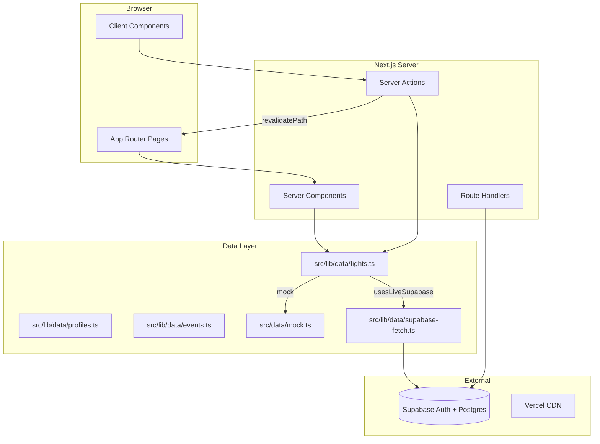
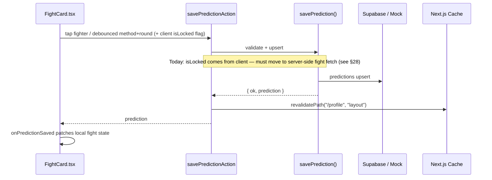
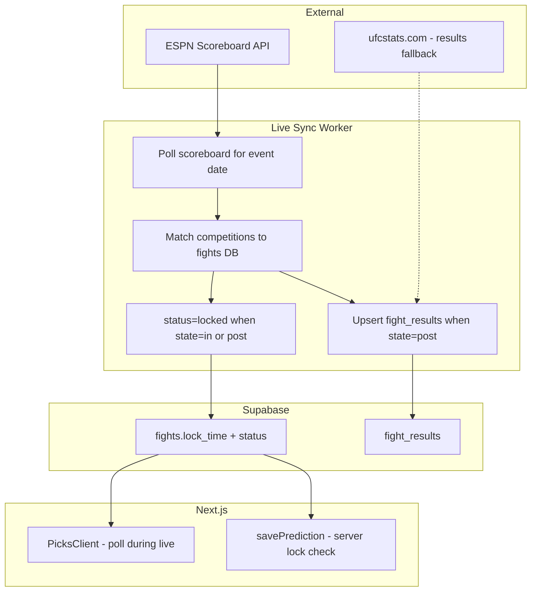

# PickFist Code Bible

**Last updated:** 15 June 2026 (billing v1 in working tree; per-fight live locking §28)  
**Production:** [pickfist.com](https://pickfist.com)  
**Repo:** `Gilganjun/pickchamp` (branch `master`)  
**Tagline:** *You Don't Know S\*\*\* About Fighting.*  
**Catalog size (mock / dev):** 23 events · 195 fights

---

## How to use this document (new Cursor chat)

When starting a fresh chat, tell Cursor:

> Read `docs/PICKFIST_CODE_BIBLE.md` first for full project context, then continue from where we left off.

Also useful companions:
- `README.md` — setup, env vars, Supabase bootstrap
- `docs/RATING_SYSTEM_IMPLEMENTATION.md` — rating formula deep dive
- `docs/ADMIN_FIGHT_CLASSIFICATION_GUIDE.md` — admin favourite fields
- `supabase/schema.sql` — database truth
- `supabase/seed_launch.sql` — launch event/fight cards
- `supabase/seed_battle_of_legends_june27.sql` — Athens card (no `card_tier`)
- `supabase/seed_ufc_freedom_250_june14.sql` — UFC Freedom 250 card (see §28 for lock-time caveat)
- `supabase/migrations/20260614_subscriptions.sql` — billing tables (run on production before Stripe)
- `supabase/fix_*.sql` — targeted production data fixes (see §24)

---

## 1. What PickFist is

PickFist is a **combat-sports prediction competition** for **boxing** and **MMA**. Users pick fight winners (and optionally method/round), earn **skill-based ratings**, and climb **global / boxing / MMA leaderboards**.

**It is NOT betting or gambling.** No money, no odds staking — only prediction skill and ratings.

### Core user journeys

| Journey | Route | Summary |
|---------|-------|---------|
| Make picks | `/picks` | Filter by sport + event card, tap fighters, auto-save picks (guests can draft in localStorage) |
| Pick Record | `/pick-record` | Full pick history, Future/Past/All tabs, PDF + TXT export (receipt-style) |
| View profile | `/profile` | Rating, rank state, current picks, sport rankings, trial notice, Pick Record CTA |
| Public profile | `/profile/[username]` | Others' profiles; open picks hidden until lock |
| Leaderboard | `/rankings` | Global / Boxing / MMA tabs |
| Browse events | `/events`, `/events/[id]` | Upcoming and settled cards |
| Auth | `/login`, `/signup` | Email/password + Google OAuth |
| Subscribe | `/subscribe` | Stripe Checkout + Customer Portal entry (live Supabase + Stripe env only) |
| Admin | `/admin/*` | Create events/fights, settle results, grade picks |

Home `/` redirects to `/picks`.

---

## 2. Tech stack

| Layer | Choice |
|-------|--------|
| Framework | **Next.js 15** App Router (`src/app/`) |
| Language | **TypeScript** |
| UI | **React 19**, **Tailwind CSS v4** |
| Backend / DB | **Supabase** (Auth + Postgres + RLS) |
| Hosting | **Vercel** (`pickfist.com`) |
| Analytics | `@vercel/analytics` in `src/app/layout.tsx` |
| Payments | **Stripe** (`stripe` npm package) — Checkout, Portal, webhooks |
| Tests | **Vitest** (`npm test`) |

**Path alias:** `@/*` → `src/*`

**Layout column:** `.pickfist-content` in `globals.css` — max-width ~32rem, centered, mobile-first.

---

## 3. Runtime modes (critical)

All data/auth code branches on `usesLiveSupabase()` in `src/lib/config.ts`:

```
hasSupabaseConfig()  → valid NEXT_PUBLIC_SUPABASE_URL + ANON_KEY
usesLiveSupabase()   → production: true when config exists
                     → local dev: false UNLESS PICKFIST_USE_SUPABASE=true
```

### Mock / demo mode (default local dev)

- No login required — demo user **`fightfan42`** (`MOCK_USER_ID` in `src/data/mock.ts`)
- Data from `src/data/mock.ts` + `src/lib/mock/demoPredictionStore.ts`
- Picks can persist to `.mock-data/demo-predictions.json` (gitignored, dev only)
- Auth actions return *"Local demo mode — use /profile and /picks without logging in."*
- Middleware skips Supabase session refresh

### Live Supabase mode (production + optional local)

- Real accounts, persistent picks in `predictions` table
- `getAuthUser()` in `src/lib/auth/session.ts`
- Middleware refreshes cookies via `src/lib/supabase/middleware.ts`
- Admin writes use **service role** client (`src/lib/supabase/admin.ts`)

### Phantom dev card (local only)

When `PICKFIST_PHANTOM_CARD=true` + `NODE_ENV=development`:
- Injects fights from `.mock-data/phantom-picks-card.json` (gitignored)
- Saves to `.mock-data/phantom-predictions.json`
- Logic: `src/lib/dev/phantomPicksDev.ts`
- Fight IDs prefixed `phantom-local-`
- **Never ships to production** (guarded in code)

---

## 4. High-level architecture



### Request flow: saving a pick



**Important:** Picks page does **not** full-refetch on save. `PicksClient.handlePredictionSaved` patches `userPrediction` in React state. Full `load()` only runs when sport/card filter changes.

---

## 5. Directory map

```
src/
├── app/                      # Routes, layouts, server actions
│   ├── actions/              # auth.ts, picks.ts, rankings.ts, admin.ts, billing.ts
│   ├── api/stripe/webhook/   # Stripe webhook (POST)
│   ├── subscribe/            # Subscription checkout page
│   ├── admin/                # Admin UI (layout gated)
│   ├── auth/callback/        # OAuth callback route
│   ├── picks/                # Main picks experience
│   ├── profile/              # Own + public profiles
│   ├── rankings/             # Leaderboards
│   ├── events/               # Event browser
│   ├── login|signup|onboarding/
│   ├── layout.tsx            # Root layout + Analytics
│   ├── globals.css           # Theme, pick impact animations
│   └── middleware.ts         # Re-exports session refresh
│
├── components/
│   ├── FightCard.tsx         # Core pick UI + auto-save
│   ├── AppShell.tsx          # Page wrapper + nav
│   ├── BrandHeader.tsx       # Logo + rotating tagline
│   ├── PickFistLogo.tsx      # PNG brand mark
│   ├── LockGraphic.tsx       # Lock overlay asset
│   ├── picks/                # PicksFilterBar, PickRatingSwing, GuestPickBanner, GuestPickMigrator
│   ├── pickRecord/           # Pick Record page UI + export sheet
│   ├── profile/              # Profile page sections, SubscriptionTrialNotice
│   ├── auth/                 # Login/signup/OAuth UI, StaySignedInField
│   └── admin/                # Admin fight fields
│
├── lib/
│   ├── config.ts             # usesLiveSupabase(), ADMIN_EMAILS
│   ├── data/                 # fights.ts, profiles.ts, events.ts, subscriptions.ts, supabase-fetch.ts
│   ├── picks/                # guestPickStore, reconcileGuestPicks, changePickRoute
│   ├── pickRecord/           # pickRecord.ts, exportPickRecord.ts (jspdf)
│   ├── billing/              # trialDates, entitlement, Stripe config, webhook claim policy
│   ├── auth/                 # session, oauth, username, rememberMe, admin gate
│   ├── rating/               # SCORING FORMULA — do not change casually
│   ├── grading/              # gradeFight.ts — batch grading on settle
│   ├── profile/              # display.ts, ratingTiers.ts, rankGraphics.ts
│   ├── rankings.ts           # Leaderboard eligibility + sort
│   ├── rankings/seedRankings.ts  # Bootstrap merge (live production only)
│   ├── supabase/             # server/client/admin clients, mappers
│   ├── mock/                 # demoPredictionStore.ts
│   ├── dev/                  # phantomPicksDev.ts
│   ├── live/                 # *(Planned §28)* ESPN poller, fight matcher, sync worker
│   ├── brand/                # subheadingPhrases.ts
│   └── datetime.ts           # All user-facing timestamps (en-GB)
│
├── data/mock.ts              # Static seed events/fights/profiles
├── data/seedRankingsProfiles.ts  # Live bootstrap leaderboard profiles (temporary)
└── types/index.ts            # Shared TS types

supabase/
├── schema.sql                # Full schema + RLS (run first)
├── seed_launch.sql           # Launch fight cards (run second)
└── migrations/             # Historical — do not re-run on fresh DB

public/
├── graphics/                 # PickfistLogo.png, Lock.png
├── ranks/                    # Rank tier PNGs
├── impact/                   # Glove punch PNGs
└── sounds/                   # Punch MP3s

docs/                         # This file + rating/admin guides
```

---

## 6. Routes reference

| Route | File | Notes |
|-------|------|-------|
| `/` | `app/page.tsx` | Redirect → `/picks` |
| `/picks` | `app/picks/page.tsx` + `PicksClient.tsx` | `dynamic = "force-dynamic"` |
| `/rankings` | `app/rankings/page.tsx` + `RankingsClient.tsx` | |
| `/events` | `app/events/page.tsx` | |
| `/events/[id]` | `app/events/[id]/page.tsx` | |
| `/profile` | `app/profile/page.tsx` | `force-dynamic`, own profile |
| `/profile/[username]` | `app/profile/[username]/page.tsx` | Public profile |
| `/pick-record` | `app/pick-record/page.tsx` + `PickRecordPageClient.tsx` | Own profile only; `force-dynamic` |
| `/login` | `app/login/page.tsx` | Stay signed in checkbox (default on) |
| `/signup` | `app/signup/page.tsx` | Separate forms for Google vs email |
| `/onboarding/username` | `app/onboarding/username/page.tsx` | Google users without username |
| `/auth/callback` | `app/auth/callback/route.ts` | OAuth code exchange |
| `/subscribe` | `app/subscribe/page.tsx` | Stripe Checkout / Portal; `force-dynamic` |
| `/api/stripe/webhook` | `app/api/stripe/webhook/route.ts` | Stripe event sync (server-only) |
| `/admin` | `app/admin/page.tsx` | Hub |
| `/admin/events` | `app/admin/events/page.tsx` | |
| `/admin/fights` | `app/admin/fights/page.tsx` | Favourite classification |
| `/admin/results` | `app/admin/results/page.tsx` | Settle + grade |

**Navigation:** `BottomNav.tsx` — Picks, Rankings, Events, Profile.

---

## 7. Authentication

### Email / password
- **Actions:** `src/app/actions/auth.ts` — `signUpAction`, `signInAction`, `signOutAction`
- Signup validates username via `src/lib/auth/username.ts`
- Profile auto-created by DB trigger `handle_new_user()` on `auth.users` insert

### Google OAuth
- `signInWithGoogleLoginAction`, `signInWithGoogleSignupAction`
- Callback: `src/app/auth/callback/route.ts` → `resolveOAuthCallbackPath()` in `src/lib/auth/oauth.ts`
- Signup flow: username stored as `pending_username` in redirect URL, applied on callback
- Login flow: users without proper username → `/onboarding/username`
- Detection: `profileNeedsUsernameOnboarding()` in `src/lib/auth/username.ts`

### Stay signed in (`rememberMe`)
- Checkbox on `/login` and `/signup` via `StaySignedInField.tsx` (default **checked**)
- Form field `rememberMe=on` parsed by `src/lib/auth/rememberMe.ts`
- Passed to `createClient({ rememberMe })` in auth actions + OAuth callback (`?remember=` param)
- Controls Supabase auth cookie `maxAge` via `getAuthCookieOptions()` in server/client/middleware
- Unchecked → session cookie (browser session only)

### Session
- Server: `createClient()` from `src/lib/supabase/server.ts` (cookies)
- Browser: `src/lib/supabase/client.ts`
- Middleware: `src/middleware.ts` → `updateSession()` only when live Supabase

### Redirect URLs (must match Supabase dashboard)
- `https://pickfist.com/auth/callback`
- `http://localhost:3000/auth/callback`

---

## 8. Data layer

### Central API: `src/lib/data/fights.ts`

| Function | Purpose |
|----------|---------|
| `getFightsForPicks(sport, userId, eventFilter)` | Active upcoming/live fights for Picks page |
| `getFightsForProfile(userId)` | All fights + relations for profile |
| `getEventsForPicks(sport, userId)` | Events with ≥1 active fight |
| `getUserPredictions(userId)` | All user predictions (+ phantom merge in dev) |
| `savePrediction(input)` | Validate → phantom/mock/Supabase upsert |

### Fight filtering: `src/lib/data/fights-utils.ts`

| Function | Purpose |
|----------|---------|
| `isActivePicksFight(fight)` | Tab `upcoming`, `live`, or `settled` (excludes cancelled/no_contest) — settled cards appear under **Past Picks** |
| `isEventPicksLocked(fights)` | **All** fights on card past lock — triggers collapsed locked UI |
| `groupFightsByEvent(fights)` | Event card sections |
| `filterFightsForPicksView()` | Sport + event filter |

### Lock state (derived — no live sync yet)

Lock is computed at read/save time in `src/lib/utils.ts`:

| Function | Purpose |
|----------|---------|
| `isFightLocked(fight)` | `true` when `status` is `locked` / `result_pending` / `settled` / `cancelled` / `no_contest`, **or** `lock_time <= now` |
| `inferFightTab(status, lock_time)` | `upcoming` \| `live` \| `settled` |
| `getLockCountdown(lock_time)` | UI countdown string |

**Per-fight vs per-card:** Each fight has its own `lock_time` and lock state. A card only collapses into the locked UI when **every** fight on it is locked (`isEventPicksLocked()` in `fights-utils.ts`). Individual `FightCard` components already respect per-fight lock — but seed data and missing live sync can make an entire card appear locked at once (see §28).

**No background worker today:** There is no cron, webhook, or bot polling external sources. `PicksClient` only refetches when sport/card filters change — not on a timer during live events.

**Known gap — server trust of client lock flag:** `FightCard.tsx` passes `isLocked` from the client into `savePredictionAction`. `savePrediction()` validates against that flag but does **not** re-fetch the fight row from the database. Any live-lock system must enforce lock server-side. See §28.

### Profiles: `src/lib/data/profiles.ts`
- `getCurrentUserProfile`, `getProfileByUsername`
- `getLeaderboard(tab)` — eligible users only
- `getProfileRanks(profile)` — `{ global, boxing, mma }` rank display objects

### Supabase reads: `src/lib/data/supabase-fetch.ts`
Joins via `src/lib/supabase/mappers.ts` → app types in `src/types/index.ts`

### Profile data loading (important)
Profile pages use **`getFightsForProfile()`** + **`getUserPredictions()`** — same path as picks (includes phantom dev data). After save, **`revalidatePath("/profile", "layout")`** in `savePredictionAction`.

---

## 9. Picks page (detailed)

### Files
- `src/app/picks/page.tsx` — server load initial data
- `src/app/picks/PicksClient.tsx` — client state, filters, event sections
- `src/components/FightCard.tsx` — per-fight pick UI
- `src/components/picks/PicksFilterBar.tsx` — sport + card dropdowns (default: All Sports / All Cards)
- `src/app/actions/picks.ts` — `loadPicksPageDataAction`, `savePredictionAction`

### Auto-save behavior (`FightCard.tsx`)
- **Fighter/draw tap** → immediate `savePredictionAction`
- **Method / round** → 500ms debounce (`METHOD_ROUND_SAVE_DEBOUNCE_MS`)
- Status UI: Saving / Saved ✓ / Pick updated ✓ / Couldn't save (retry)
- **No "Lock my pick" button** — removed in favor of auto-save
- Locked/settled fights: read-only panel with `LockGraphic` + saved pick line
- **`PickLockSection` hidden until a pick exists** — returns `null` when no saved pick, no guest draft, and not saving (`PickRatingSwing.tsx`). Grey wrapper in `FightCard.tsx` only mounts when `existing || outcome || saveStatus === "saving"`.

### Guest picks (unauthenticated)
- **Store:** `src/lib/picks/guestPickStore.ts` — `localStorage` key `pickfist-guest-picks`, 48h expiry
- **UI:** `FightCard` accepts `guestDraft`; save status `"guest"` until login
- **Banner:** `GuestPickBanner.tsx` in `BottomNav` — prompts sign-up when drafts exist
- **Migration:** `GuestPickMigrator.tsx` (mounted in layout) calls `migrateGuestPicksAction` after auth
- **Reconcile:** `reconcileGuestPicks.ts` — prunes guest store on logout/login cycles; fixes stale banner bugs
- **Live Supabase only** for migration to `predictions` table; mock mode uses demo store directly
- Guests have **unlimited** picks today (no subscription enforcement)

### Change Pick deep links
- `src/lib/picks/changePickRoute.ts` → `/picks?sport=…&event=…&fight=…`
- `CurrentPickCard.tsx` links to focused fight; `PicksClient` expands correct card/section

### Locked event cards (`PicksClient.tsx` → `EventCardSection`)
When `isEventPicksLocked(cardFights)` — i.e. **all** fights on the card are locked:
1. **Never auto-expands** (even if card filter selected)
2. Badge: **"Picks Locked — Event Started"** (amber) — misleading during partial live cards; planned UX change in §28
3. **Collapsed** by default; `LockGraphic variant="card"` centered overlay
4. User can still tap to expand and view picks

During a live card with mixed state (some fights finished, some still open), the card stays expandable and only individual locked fights show the lock panel. Correct per-fight behavior depends on accurate `lock_time` values and/or live sync (§28).

### Pick impact FX (Picks page only)
- Glove overlay: `PickImpactOverlay.tsx`, assets `/impact/Glove1.png`, `Glove2.png`
- Sound: `src/lib/audio/playPickImpactSound.ts`, `/sounds/Punch*.mp3`
- Enabled via `enablePickImpact` prop on `FightCard`

### Rating swing display (UI only — not scoring)
- `src/lib/rating/getPickPotential.ts` — potential win/loss per pick
- `src/components/picks/PickRatingSwing.tsx` — inline + summary panels
- Uses admin-set `favourite_side` + `favourite_level` on each fight

---

## 10. Profile page (detailed)

### Files
- `src/app/profile/page.tsx` — own profile (auth required in live mode)
- `src/app/profile/[username]/page.tsx` — public
- `src/components/profile/ProfilePageContent.tsx` — composes sections
- `src/lib/profile/display.ts` — **all profile display logic**

### Typography (profile)
- **Teko** font (`--font-teko` in `layout.tsx`) used for level names, section headings, world-rank numbers, subscription trial banner
- Own profile uses `AppShell` with `centeredBrand` (PickFist logo header) + `headerTrailing={<LogoutButton />}`
- `ProfileSectionHeading.tsx` — centered Teko section titles
- `RankingTitleHeader.tsx` — globe icon + Teko rank titles (hero + card sizes)
- `WorldRankInTheWorldBadge.tsx` — diagonal `-rotate-12` **"in the world"** chip on sport rank displays (red=boxing, purple=mma)

### Sections
| Section | Component | Key logic |
|---------|-----------|-----------|
| Trial notice | `SubscriptionTrialNotice.tsx` | **Own profile only** — status-aware gold banner; links to `/subscribe` or Stripe Portal; dates from `subscriptions` row (fallback: `profiles.created_at` via `trialDisplay.ts`) |
| Hero | `ProfileHero.tsx` | Teko level name, world rank states, `PickRecordHeroButton`, compact recent form |
| Sport rankings | `SportRankingsSection.tsx` | Tappable boxing/MMA cards with world rank + "in the world" badge; scroll/focus cues |
| Current picks | `CurrentPicksSection.tsx` | Carousel; **Change Pick** deep links to `/picks?…` |
| Recent results | `RecentPredictionCard.tsx` | Last 8 graded (replaces separate Recent Form section in hero flow) |
| Detailed stats | `DetailedStatsSection.tsx` | Deeper counters |

### Global rank hero states (`getGlobalRankHeroState`)
Uses **`getLockedPickCount()`** (picks on fights past lock time):
- **`needs_locked`** — "X PICKS TO QUALIFY" (orange) — need 10 locked picks for global
- **`waiting_results`** — "QUALIFIED" + waiting (gold) — ≥10 locked, not officially ranked yet
- **`official`** — "#N WORLD" — on leaderboard with official rank

Thresholds in `src/lib/rating/constants.ts`: global **10**, boxing **5**, mma **5**.

### Current picks privacy
- **Own profile:** all ungraded active picks shown
- **Public profile:** only picks on **locked** fights (`isCurrentPickPublicVisible`)
- Empty public + hidden open picks → "Current picks are hidden until fights lock."

### Display tier ladder (UI only)
`src/lib/profile/ratingTiers.ts` — Novice → All-Time Great (12 steps).  
**Does not affect rating math.** Rank graphics: `src/lib/profile/rankGraphics.ts` → `/public/ranks/*.png`

### Pick Record (profile entry + dedicated page)
| File | Role |
|------|------|
| `src/lib/pickRecord/pickRecord.ts` | Classify picks (future/past), status labels, sort/group for list |
| `src/lib/pickRecord/exportPickRecord.ts` | Receipt-style **PDF** (jspdf) + **TXT** export |
| `src/app/pick-record/page.tsx` | Server page — auth required in live mode |
| `src/components/pickRecord/PickRecordPageClient.tsx` | Future / Past / All tabs |
| `src/components/pickRecord/PickRecordExportSheet.tsx` | Export scope + format picker |
| `src/components/profile/PickRecordHeroButton.tsx` | CTA in profile hero with upcoming/settled counts |

Statuses: `pending` | `waiting_for_results` | `won` | `lost` | `perfect`  
Dependency: **jspdf** for PDF generation.

---

## 11. Subscription & billing

### Status (June 2026)

| Layer | State |
|-------|--------|
| **Production (deployed)** | Visual trial banner only (`154ad39`); no Stripe env, no `subscriptions` table |
| **Working tree (pending commit/deploy)** | Full billing v1 — Stripe Checkout, Portal, webhooks, `subscriptions` table — **pick limits not enforced yet** |

### Product policy

- **1 calendar month** free trial from signup (`TRIAL_LENGTH_MONTHS = 1` in `trialDates.ts`)
- Users may subscribe **anytime during trial**; Stripe charges only after trial ends
- Early subscribe preserves remaining trial via Stripe `trial_end` on Checkout
- **Canceled during trial:** access continues until `trial_ends_at`; new Checkout blocked (Portal only)
- **`hasPremiumAccess()`** is the future enforcement hook — all users still have unlimited picks today

### Database (`subscriptions` — separate from `profiles`)

Migration: `supabase/migrations/20260614_subscriptions.sql` (also reflected in `schema.sql`)

| Table | Purpose |
|-------|---------|
| `subscriptions` | One row per user: Stripe IDs, `status`, `trial_started_at`, `trial_ends_at`, `checkout_trial_adjusted_at`, `current_period_end`, `cancel_at_period_end` |
| `stripe_webhook_events` | Idempotent webhook processing (`processing` / `completed` / `failed`) |

- **Trigger:** `handle_new_user()` also inserts `subscriptions` row with fixed trial window
- **Backfill:** migration backfills existing profiles
- **RLS:** users `SELECT` own row; writes via service role / webhook only

### Key modules

| File | Role |
|------|------|
| `src/lib/billing/trialDates.ts` | Trial window math, `resolveCheckoutTrialEnd()`, Stripe 49h minimum buffer |
| `src/lib/billing/subscriptionEntitlement.ts` | `isTrialing()`, `isCanceledDuringTrial()`, `hasPremiumAccess()`, checkout guards |
| `src/lib/billing/subscriptionDisplay.ts` | Profile banner copy/CTAs by status |
| `src/lib/billing/trialDisplay.ts` | Date formatting fallback when no subscription row |
| `src/lib/billing/stripeConfig.ts` | Env gate (`stripeEnabled()`), price ID |
| `src/lib/billing/stripeClient.ts` | Server Stripe SDK singleton |
| `src/lib/billing/webhookClaimPolicy.ts` | Stale-reclaim idempotency for webhook events |
| `src/lib/data/subscriptions.ts` | CRUD + `ensureSubscriptionForUser`, `persistCheckoutTrialEnd` |
| `src/lib/supabase/subscriptionMapper.ts` | DB row ↔ `Subscription` type |
| `src/app/actions/billing.ts` | `createCheckoutSessionAction`, `createCustomerPortalSessionAction` |
| `src/app/api/stripe/webhook/route.ts` | Sync Stripe subscription state to DB |
| `src/app/subscribe/page.tsx` | Subscribe / manage UI |

### Checkout trial-end policy (`resolveCheckoutTrialEnd`)

Stripe requires `trial_end` ≥ ~48h ahead. PickFist uses a **49h buffer**:

| Condition | Checkout `trial_end` |
|-----------|----------------------|
| Active trial, **>49h** remaining | Stored `trial_ends_at` |
| Active trial, **<49h** remaining, not yet adjusted | Extend once to **checkout + 3 calendar days**; persist + set `checkout_trial_adjusted_at` |
| Already adjusted (`checkout_trial_adjusted_at` set) | Reuse stored date (bump to 49h minimum only) |
| Trial expired | No `trial_end` → immediate billing |

Also: Stripe idempotency key on session create; reuse open Checkout session URL when available; block duplicate Checkout when Stripe sub exists during trial/paid period.

### Webhook idempotency

RPC `claim_stripe_webhook_event` on `stripe_webhook_events`:

- `completed` → skip duplicate
- `failed` → reclaim immediately
- `processing` <5 min → `busy` (Stripe retries)
- `processing` ≥5 min → **stale reclaim** (crash recovery)

Mark `completed` only after DB sync succeeds; failures → `failed` + HTTP 500 for Stripe retry.

### Planned (not built — needs explicit approval)

| Tier | Proposed limits |
|------|-----------------|
| **Standard** (post-trial) | 3 picks per day |
| **Premium** | ~£4.99/mo — unlimited picks |

Recommended enforcement point: `savePrediction()` in `src/lib/data/fights.ts` calling `hasPremiumAccess()`.  
Guests currently unlimited in `localStorage`; logged-in users unlimited until enforcement ships.

### Deploy checklist (billing v1)

1. Commit billing code
2. Create Stripe test product + price → `STRIPE_PRICE_ID`
3. Run `20260614_subscriptions.sql` in Supabase
4. Add Stripe env vars to Vercel (see §19)
5. Deploy
6. Register webhook endpoint in Stripe Dashboard → `STRIPE_WEBHOOK_SECRET` → redeploy
7. End-to-end test in Stripe test mode before switching to live keys

---

## 12. Rankings / leaderboard

- `src/lib/rankings.ts` — eligibility, sort order, rank display states
- `src/app/rankings/RankingsClient.tsx` — tabs: global / boxing / mma
- `RankingsHero.tsx` → `TabBar` with `pulseActive` — calm fade on active tab
- `src/app/actions/rankings.ts` — `loadLeaderboardAction(tab)`

**Sort:** rating desc → graded count desc → accuracy desc → username asc  
**Eligible only** on leaderboard (meets pick threshold for tab).

Rank states: `inactive` | `provisional` | `official`

### Bootstrap seed rankings (temporary — live production only)

Static starter leaderboard entries so early visitors see an active community. **App-layer only** — no Supabase auth accounts, no predictions, no prizes.

| File | Role |
|------|------|
| `src/data/seedRankingsProfiles.ts` | 14 fixed profiles (IDs `…-b000-…`), ≥10 eligible per tab, ratings capped at 1075 |
| `src/lib/rankings/seedRankings.ts` | Merge logic, collision handling, `isSeedRankingsProfile()` |
| `src/lib/data/profiles.ts` | Ranking merge in `getLeaderboard()` + `getProfileRanks()`; seed resolution in `getProfileByUsername()` |

**Progressive replacement per tab:**

```
seedsToShow = max(0, PICKFIST_SEED_RANKINGS_TARGET - realEligibleCount)
```

Genuine **eligible** users fill Top 10 slots; seeds disappear as slots fill — not when individual users exceed seed scores. When genuine eligible ≥ target, show all genuine users and zero seeds.

**Safeguards:**

- Genuine profiles always win over seeds (by `id` or normalized `username` collision).
- Seed profiles resolve to **minimal read-only** `/profile/[username]` pages (stats + ranks only; no pick history).
- Ranking cards link to profile pages for all leaderboard entries.
- Seeds never merged into `getAllProfiles()`, admin, auth, predictions, analytics, or future prize/FOTN logic.
- **Opt-in only:** `PICKFIST_SEED_RANKINGS=true` on Vercel Production; redeploy required after env change.

**Env vars:** `PICKFIST_SEED_RANKINGS` (default off), `PICKFIST_SEED_RANKINGS_TARGET` (default 10). See §19 and `docs/BOOTSTRAP_RANKINGS_IMPLEMENTATION.md`.

**Removal:** Disable env flag + redeploy, then delete seed modules when no longer needed.

Tests: `src/lib/rankings/seedRankings.test.ts`

---

## 13. Events page

- `src/lib/data/events.ts` — `getEventsWithMeta()`, `getEventDetail()`
- `EventWithMeta` adds `fightCount`, `sports[]`, `isSettled`
- Launch cards in `supabase/seed_launch.sql`: Steel City King, UFC Fight Night, Zuffa Boxing 7

---

## 14. Admin system

### Access (`src/lib/auth/admin.ts` + `src/app/admin/layout.tsx`)
| Mode | Rule |
|------|------|
| Mock | Admin open to all |
| Production | Authenticated + email in `ADMIN_EMAILS` env |
| Unauthorized | Static "Unauthorized" page |
| Unauthenticated | Redirect `/login?next=/admin` |

### Actions (`src/app/actions/admin.ts`)
- `createEvent`, `createFight`, `settleFight`, `getAdminData`
- Writes via **service role** — bypasses RLS

### Settle + grade flow
1. Admin enters result on `/admin/results`
2. `settleFight` upserts `fight_results`, sets fight `status = settled`
3. `src/lib/grading/gradeFight.ts` grades all predictions:
   - Calls `calculateRatingChange()` per prediction
   - Updates `predictions` grading fields
   - Updates `profiles` counters + ratings
   - Inserts `rating_history` + `grading_runs`

### Favourite classification (affects rating tier)
Set per fight at creation: `favourite_side` + `favourite_level`  
Guide: `docs/ADMIN_FIGHT_CLASSIFICATION_GUIDE.md`  
Validated by `src/lib/rating/validateFavouriteFields.ts`

---

## 15. Rating system (DO NOT CHANGE WITHOUT EXPLICIT APPROVAL)

**Popularity is analytics only** — not used in `ratingChange`.

### Core files
| File | Role |
|------|------|
| `src/lib/rating/calculateRatingChange.ts` | Main formula |
| `src/lib/rating/tierRatings.ts` | **Central tier table** — "Do not scatter these values" |
| `src/lib/rating/getEffectivePickTier.ts` | Maps favourite + user pick → effective tier |
| `src/lib/rating/constants.ts` | Bonuses, clamps, eligibility thresholds |
| `src/lib/rating/validatePrediction.ts` | Pre-save validation |
| `src/lib/grading/gradeFight.ts` | Batch grading |

### Tier base points (`TIER_RATINGS`)
| Tier | Correct | Wrong |
|------|---------|-------|
| heavy_favourite | +5 | -15 |
| favourite | +10 | -12 |
| even | +15 | -15 |
| underdog | +25 | -10 |
| heavy_underdog | +40 | -8 |
| draw | +20 | -15 |

**Sub-pick adjustments:** method ±4/-2, round ±8/-3, perfect +5  
**Clamps:** max gain +75, max loss -20

### UI-only (safe to adjust visually)
- `getPickPotential.ts` — picks page swing display
- `ratingTiers.ts` — profile tier ladder labels
- `rankGraphics.ts` — tier PNG mapping

Full spec: `docs/RATING_SYSTEM_IMPLEMENTATION.md`

---

## 16. Database schema

Run order: `schema.sql` → `seed_launch.sql`

| Table | Purpose |
|-------|---------|
| `profiles` | User stats, ratings, streaks, `is_admin` |
| `events` | Event metadata |
| `fights` | Bouts, `lock_time`, `status`, favourite fields |
| `predictions` | User picks + grading results; unique `(user_id, fight_id)` |
| `fight_results` | Official outcomes (one per fight) |
| `rating_history` | Audit trail per graded pick |
| `grading_runs` | Admin grading batch metadata |
| `subscriptions` | Billing entitlement + Stripe sync (see §11) |
| `stripe_webhook_events` | Webhook idempotency state machine |

**RLS:** public SELECT; users INSERT/UPDATE own profile + predictions; users SELECT own subscription.  
**Trigger:** `handle_new_user()` creates profile + subscription row on signup.  
**Migration:** `migrations/20260614_subscriptions.sql` — run on production before enabling Stripe.  
**Do not run** `migrations/20260603_favourite_rating_v2.sql` on fresh DB (already in schema).

---

## 17. Server actions (complete list)

### `src/app/actions/auth.ts`
- `signUpAction`, `signInAction`, `signOutAction`
- `signInWithGoogleSignupAction`, `signInWithGoogleLoginAction`
- `completeUsernameOnboardingAction`

### `src/app/actions/picks.ts`
- `loadPicksPageDataAction(sport, eventCard)`
- `savePredictionAction(input)` — revalidates profile on success
- `migrateGuestPicksAction(drafts)` — upserts guest localStorage picks after login

### `src/app/actions/rankings.ts`
- `loadLeaderboardAction(tab)`

### `src/app/actions/admin.ts`
- `createEvent`, `createFight`, `settleFight`, `getAdminData`

### `src/app/actions/billing.ts`
- `createCheckoutSessionAction` — Stripe Checkout with trial preservation + guards
- `createCustomerPortalSessionAction` — manage/cancel via Stripe Portal

---

## 18. Branding & assets

| Asset | Path | Component |
|-------|------|-----------|
| Logo | `/graphics/PickfistLogo.png` | `PickFistLogo.tsx` (sizes: sm/md/lg/auth) |
| Lock | `/graphics/Lock.png` (205×205) | `LockGraphic.tsx` (card/notice) |
| Rank tiers | `/ranks/Rank_*.png` | `RankGraphic.tsx` |
| Gloves | `/impact/Glove1.png`, `Glove2.png` | `PickImpactOverlay.tsx` |
| Sounds | `/sounds/Punch*.mp3` | `playPickImpactSound.ts` |

**Header:** `BrandHeader.tsx` — logo (`object-bottom`), rotating tagline (`RotatingSubheading.tsx`), optional profile link.  
**Tagline phrases:** `src/lib/brand/subheadingPhrases.ts` (8 phrases, rotates on Picks page).  
**Teko font:** loaded in `src/app/layout.tsx` as `--font-teko` — profile headings, ranks, trial banner.

Source masters live in `/Graphics/` (repo root, often untracked locally).

---

## 19. Environment variables

See `.env.example`:

| Variable | Scope | Purpose |
|----------|-------|---------|
| `NEXT_PUBLIC_SUPABASE_URL` | Public | Supabase project URL |
| `NEXT_PUBLIC_SUPABASE_ANON_KEY` | Public | Anon key |
| `SUPABASE_SERVICE_ROLE_KEY` | **Server only** | Admin writes |
| `ADMIN_EMAILS` | Server | Comma-separated admin emails |
| `PICKFIST_USE_SUPABASE` | Local dev | `true` = live Supabase locally |
| `PICKFIST_PHANTOM_CARD` | Local dev | Phantom test card |
| `PICKFIST_SEED_RANKINGS` | Server | Opt-in: must be `true` to enable bootstrap seeds (set on Vercel Production) |
| `PICKFIST_SEED_RANKINGS_TARGET` | Production | Target visible rows per tab during bootstrap (default 10) |
| `STRIPE_SECRET_KEY` | **Server only** | Stripe API key (`sk_test_…` or live) |
| `NEXT_PUBLIC_STRIPE_PUBLISHABLE_KEY` | Public | Stripe publishable key |
| `STRIPE_PRICE_ID` | Server | Subscription price ID from Stripe Dashboard |
| `STRIPE_WEBHOOK_SECRET` | **Server only** | Webhook signing secret (`whsec_…`) |
| `NEXT_PUBLIC_APP_URL` | Public | Site origin for Checkout return URLs (e.g. `https://pickfist.com`) |
| `PICKFIST_SUBSCRIPTION_PRICE_LABEL` | Server | Optional display label on `/subscribe` |
| `CRON_SECRET` | Server | *(Planned §28)* Bearer for `/api/cron/sync-live-fights` |

**Never commit** `.env.local`, `.mock-data/`, or secrets.

---

## 20. Testing

```bash
npm test          # vitest run (all *.test.ts under src/)
npm run test:watch
npm run build     # production build check
```

Key test files:
- `src/lib/rating/calculateRatingChange.test.ts` — scoring formula
- `src/lib/profile/display.test.ts` — profile display logic
- `src/lib/data/fights-utils.test.ts` — locked card helpers
- `src/lib/rankings/seedRankings.test.ts` — bootstrap leaderboard merge + collision handling
- `src/lib/pickRecord/pickRecord.test.ts` — pick record classify/sort
- `src/lib/billing/trialDisplay.test.ts` — trial date display
- `src/lib/billing/trialDates.test.ts` — trial window + checkout trial-end policy
- `src/lib/billing/subscriptionEntitlement.test.ts` — premium access + checkout guards
- `src/lib/billing/subscriptionDisplay.test.ts` — banner copy by status
- `src/lib/billing/webhookClaimPolicy.test.ts` — webhook stale-reclaim policy
- `src/app/api/stripe/webhook/route.test.ts` — webhook handler
- `src/lib/picks/guestPickStore.test.ts`, `reconcileGuestPicks.test.ts`
- `src/lib/auth/oauth.test.ts`, `username.test.ts`, `rememberMe.test.ts`

**Rule:** Do not change rating formula to make tests pass — tests document intended behavior.

---

## 21. Deployment

```bash
git push origin master
npx vercel --prod --yes
```

- **Production URL:** pickfist.com
- **Vercel project:** pickfist (separate from other sites on account)
- Env vars must be set in Vercel dashboard (Supabase + `ADMIN_EMAILS` + Stripe when billing enabled)
- **Billing:** run `20260614_subscriptions.sql` in Supabase before first Stripe deploy; register webhook after deploy
- Enable Web Analytics in Vercel dashboard (code already includes `<Analytics />`)
- Google OAuth: configure in Google Cloud + Supabase Auth providers

### OneDrive / Windows dev note
Project may live in OneDrive. Stale `.next` causes broken CSS.  
`npm run dev` runs `scripts/clean-next.mjs` first. Delete `.next` if styles break.

---

## 22. Cookbook: how to change common things

### Add a new fight card (production)
1. Insert rows in Supabase `events` + `fights` (or use `/admin/events` + `/admin/fights`)
2. Set `lock_time`, `favourite_side`, `favourite_level`, `scheduled_rounds`, `fight_order`
3. Optionally add to `supabase/seed_launch.sql` for fresh DBs

### Change pick lock behavior
- Lock inference: `src/lib/utils.ts` (`isFightLocked`, `inferFightTab`)
- Locked card collapse: `PicksClient.tsx` + `isEventPicksLocked()` in `fights-utils.ts`
- Pick locked panel: `FightCard.tsx`
- Save enforcement: `savePrediction()` in `fights.ts` + `savePredictionAction` in `picks.ts` — **must** re-fetch fight and compute lock server-side (§28 Phase 0)
- Per-fight `lock_time` when seeding: set estimated ringwalk per bout, not card segment start (§28)
- Live sync worker (when built): §28 — ESPN poller + Vercel Cron

### Change profile hero / qualification text
- `src/lib/profile/display.ts` — `getGlobalRankHeroState`, `getLockedPickCount`
- Thresholds: `src/lib/rating/constants.ts`

### Change leaderboard eligibility
- `src/lib/rating/constants.ts` — `GLOBAL_RANK_ELIGIBILITY`, sport thresholds
- `src/lib/rankings.ts` — sort/eligibility logic

### Add rotating tagline phrase
- `src/lib/brand/subheadingPhrases.ts` — append to `ROTATING_SUBHEADING_PHRASES`

### Change logo size/spacing
- `src/components/PickFistLogo.tsx` — SIZE constants
- `src/components/BrandHeader.tsx` — padding, tagline margin
- `src/components/RotatingSubheading.tsx` — min-height

### Add new page with standard chrome
```tsx
import { AppShell } from "@/components/AppShell";

export default function MyPage() {
  return (
    <AppShell showTagline={false}>
      {/* content */}
    </AppShell>
  );
}
```

Props: `prominentBrand`, `showProfileLink`, `showBottomNav`, `showBrand`

### Fix production data without redeploy
See **§24 Production SQL playbook** — use targeted `supabase/fix_*.sql` and `seed_*_fights_only.sql` files.

### Add Pick Record export styling
- `src/lib/pickRecord/exportPickRecord.ts` — PDF layout + TXT format

### Change subscription trial banner / billing UX
- `src/components/profile/SubscriptionTrialNotice.tsx` — copy/styling; links to `/subscribe`
- `src/lib/billing/subscriptionDisplay.ts` — status-aware headlines/sub-lines/CTAs
- `src/lib/billing/trialDates.ts` — trial length (1 calendar month) + Checkout trial-end policy
- `src/app/subscribe/page.tsx` — subscribe page layout and error states
- Stripe product/price: Dashboard or Cursor Stripe MCP (`.cursor/mcp.json` — OAuth, separate from app env vars)

### Enable billing in production
See §11 deploy checklist — migration → env vars → deploy → webhook secret → test mode E2E before live keys.

---

## 23. What NOT to modify (unless explicitly requested)

| Area | Reason |
|------|--------|
| `TIER_RATINGS` / `calculateRatingChange.ts` | Core fairness formula |
| Retroactive regrading | No V1→V2 migration of old picks |
| Popularity modifier on ratings | Documented but **not implemented** — needs product approval |
| `ratingTiers.ts` affecting scoring | Display-only ladder |
| `SUPABASE_SERVICE_ROLE_KEY` on client | Security |
| `.mock-data/` contents | Gitignored dev files |
| Run old migrations on fresh DB | Columns already in `schema.sql` |
| Phantom card in production | Dev-only guards in `phantomPicksDev.ts` |
| Enforce subscription pick limits without product sign-off | `hasPremiumAccess()` exists but `savePrediction()` not wired; guests unlimited today |
| Insert `card_tier` on production events | Column does not exist in live schema |

---

## 24. Production SQL playbook

**Run in Supabase SQL editor** — not via app deploy. Prefer idempotent scripts (`ON CONFLICT DO NOTHING`, targeted `UPDATE`).

### Schema gotchas (production)
| Issue | Cause | Fix |
|-------|-------|-----|
| `card_tier` column error | Column exists in some dev seeds but **not** in production `events` table | Never insert `card_tier` on production; use `seed_battle_of_legends_june27.sql` (corrected) |
| Athens card shows **0 fights** | Event row exists from `seed_launch.sql` without fight rows | Run `supabase/seed_battle_of_legends_fights_only.sql` |
| Bam card wrong title | Old name `Rodriguez vs. Vargas` | `supabase/fix_rodriguez_vargas_event_name.sql` or `UPDATE … WHERE id = 'e0000006-0006-4000-a000-000000000006'` |
| Mayweather not first on card | Wrong `fight_order` | `supabase/fix_battle_of_legends_fight_order.sql` |
| UFC Freedom favourites wrong | Seed drift | `supabase/fix_ufc_freedom_250_favourites.sql` |
| UFC Freedom picks lock too early | Six of seven fights share main-card `lock_time` (`2026-06-15T00:00:00Z`) in `seed_ufc_freedom_250_june14.sql` | Per-fight ringwalk times + live sync (§28); manual `UPDATE fights SET status = 'locked'` only for bouts already live/finished |
| Brooks opponent name | Was wrong on Fury card | `supabase/fix_rahim_pardesi_name.sql` |

### When to use which Athens / Battle of Legends script
| Situation | File |
|-----------|------|
| Fresh production — event + fights missing | `seed_battle_of_legends_june27.sql` |
| Event `e0000023` exists, 0 fights | `seed_battle_of_legends_fights_only.sql` |
| Fights exist, Mayweather not `fight_order = 1` | `fix_battle_of_legends_fight_order.sql` |

### Event IDs (production UUIDs)
| Card | Event ID | Mock `evt-*` |
|------|----------|--------------|
| Bam Rodriguez vs. Vargas | `e0000006-0006-4000-a000-000000000006` | `evt-006` |
| Mayweather vs. Zambidis (Battle of the Legends) | `e0000023-0023-4000-a000-000000000023` | `evt-023` |
| UFC Freedom 250: Topuria vs Gaethje | `e0000022-0022-4000-a000-000000000022` | `evt-022` |

Mayweather main event: `fight_order = 1`, appears in **both** Boxing and MMA sport filters (mixed card).

---

## 25. Current state (handoff snapshot — 15 June 2026)

### Latest deployed commits (newest first)
| Commit | Summary |
|--------|---------|
| `3285c75` | Profile page centered logo header; smaller trial notice; logout in header trailing slot |
| `e2d6e71` | Calm fade pulse on active Global/Boxing/MMA rankings tab |
| `ea85819` | Local mock rankings aligned with profile scoring; improved rankings help modal |
| `543e5b9` | Super Pick scoring; simplified rankings help modal |
| `539b6e3` | Bootstrap seed profiles renamed with realistic display names |
| `2f464c9` | Bootstrap Top 10 rankings with strict opt-in `PICKFIST_SEED_RANKINGS` flag |
| `154ad39` | Profile free-trial subscription notice (visual); Athens seed SQL fixes |
| `b701c1c` | Battle of Legends card (`evt-023`); pick UX cleanup; receipt-style Pick Record PDF export |
| `499113c` | Pick Record page (`/pick-record`), table-based PDF/TXT export, profile UX polish |
| `e8bad6b` | UFC Freedom 250 White House card (`evt-022`); verified odds alignment |
| `ce4fff2` | Clear stale guest-pick banner after login/logout |
| `2acc63d` | Stay signed in + persistent auth cookies (`rememberMe`) |
| `d7c9422` | Guest draft picks in localStorage + post-login migration |
| `d672c79` | Change Pick deep links; tappable sport ranking scroll on profile |
| `7ea3de7` | Profile hero level rankings, record stats, swipe cues |
| `b7a1270` | World ranks (not raw ratings) on profile + rankings header |

### Catalog inventory (mock data, time-sensitive)

Evaluated with `isFightLocked()` + `isEventPicksLocked()` against `getMockFightWithRelations()`:

| Metric | Count (≈12 Jun 2026 UTC) |
|--------|---------------------------|
| Total fights | 195 |
| Total events | 23 |
| **Pickable fights** | **167** (154 boxing · 13 mma) |
| **Active fight cards** | **20** |
| Locked/past cards | 3 |

**Locked cards (all fights settled/locked):** Steel City King (8), Zuffa Boxing 7 (8), UFC Fight Night: Muhammad vs. Bonfim (12).

**Pickable** = `status === "upcoming"` AND `lock_time > now`. Counts decrease as lock times pass.

Production Supabase may differ if seeds/fixes not applied.

### Launch content (SQL seeds)

**Settled launch weekend (6–7 Jun 2026):** Steel City King, UFC Fight Night: Muhammad vs. Bonfim, Zuffa Boxing 7 — results in `seed_results_june6_2026.sql`.

**Upcoming cards (representative — see `supabase/seed_*.sql`):**
- **13 Jun:** Fury vs. Hall, Hawley vs. Steward, **Bam Rodriguez vs. Vargas**, MVPW-04
- **14 Jun:** Gonzalez vs. Perez, **UFC Freedom 250: Topuria vs. Gaethje** (`seed_ufc_freedom_250_june14.sql`)
- **19–27 Jun:** Pugilist Revolution through Zayas vs. Ennis
- **27 Jun:** **Mayweather vs. Zambidis** — Battle of the Legends, Athens (`seed_battle_of_legends_june27.sql`) — 15 fights, boxing + MMA menu

### Not yet implemented (paused / planned)
- **Per-fight live locking bot** — ESPN scoreboard poller, server-side lock enforcement, client refresh during live cards (full design §28)
- **Billing deploy** — Stripe + `subscriptions` table implemented in working tree; pending commit, migration, env vars, webhook registration (see §11)
- **Pick limits** — `hasPremiumAccess()` ready; `savePrediction()` enforcement deferred until billing stable in test mode
- Standard vs Premium daily pick caps (see §11)

### Known local dev tools
- `PICKFIST_USE_SUPABASE=true` — test live auth/data locally
- `PICKFIST_PHANTOM_CARD=true` — open test card with future lock times

### Manual setup still on owner
- Google OAuth provider in Supabase + Google Cloud Console
- Vercel Web Analytics toggle in dashboard
- `ADMIN_EMAILS` for admin access
- Set **`PICKFIST_SEED_RANKINGS=true`** on Vercel Production for bootstrap Top 10 (redeploy after env change)
- **Billing (when ready):** Stripe test product/price, Supabase migration, Vercel Stripe env vars, webhook endpoint (§11)
- Run production SQL fixes above when cards missing or misnamed on live DB

### Uncommitted in working tree (June 2026)
Full billing v1 (Stripe Checkout/Portal/webhook, `subscriptions` table, status-aware trial banner). **429 tests passing** locally. Not deployed until committed + migration + env vars.

---

## 26. Type reference (quick)

Defined in `src/types/index.ts`:

- `Sport`: `"boxing" | "mma"`
- `FightStatus`: upcoming → locked → result_pending → settled (+ cancelled/no_contest)
- `PredictedOutcome`: fighterA | fighterB | draw
- `FavouriteSide`: fighterA | fighterB | none
- `FavouriteLevel`: heavy_favourite | favourite | even
- `FightWithRelations`: Fight + event + result + userPrediction
- `RankingTab`: global | boxing | mma
- `SubscriptionStatus`: trialing | active | past_due | canceled | unpaid | incomplete | incomplete_expired | paused
- `Subscription`: billing row (separate from `Profile`)

---

## 27. Key conventions for contributors

1. **Branch on `usesLiveSupabase()`** for every data path — never assume Supabase exists.
2. **Server actions** for all mutations (picks, auth, admin).
3. **Mappers** for all DB rows (`mappers.ts`) — don't inline row shapes.
4. **Dynamic imports** of Supabase in mock-safe modules (`fights.ts` pattern).
5. **Lock state is derived, not pushed** — today computed from `lock_time` + `status` with no live sync cron; when §28 ships, server-side enforcement is authoritative and the worker updates `status` from external sources.
6. **Round options** from `fight.scheduled_rounds` — never hardcode 12 or 5.
7. **Minimize scope** — focused diffs; don't refactor unrelated code.
8. **Tests** for rating/display logic changes; `npm run build` before deploy.
9. **Revalidate** profile after pick saves if adding new save paths.
10. **Rating math lives in one place** — UI reads `getPickPotential`, never duplicates tiers.
11. **Guest picks** — never write guest drafts to Supabase directly; use `guestPickStore` + `migrateGuestPicksAction`.
12. **Production SQL** — data fixes go in `supabase/fix_*.sql` / idempotent seeds; do not assume `card_tier` or other dev-only columns exist on live DB.
13. **Billing** — entitlement lives in `subscriptions` table + `hasPremiumAccess()`; pick enforcement in `savePrediction()` is **not wired** until explicitly requested.
14. **Bootstrap seed rankings** — merge only in `getLeaderboard` / `getProfileRanks`; filter with `isSeedRankingsProfile()` in any future prize or user-count logic.
15. **Never trust client `isLocked`** on pick save — always re-fetch fight from DB until §28 Phase 0 is merged.

---

## 28. Per-fight live locking (design + roadmap)

**Status:** Design approved; **not yet implemented** in code (as of 15 Jun 2026).

### Problem

Users should pick individual fights on a card **as close to each bout's start as possible** — not when the card or main-card segment starts. During a live event, finished and in-progress fights must be locked while later bouts on the same card stay open.

The app **already supports per-fight lock in code** (`isFightLocked` per fight; card collapses only when `isEventPicksLocked` = all fights locked). What is missing:

1. **Seed data** — e.g. UFC Freedom 250: six of seven fights in `seed_ufc_freedom_250_june14.sql` share `lock_time = 2026-06-15T00:00:00Z` (8:00 PM EDT main-card start); only Topuria vs Gaethje has a later time (`03:00 UTC`). When that timestamp passes, all six co-main fights lock together even if hours apart on the broadcast.
2. **Live sync** — no worker polls external sources to lock fights when they actually start or finish.
3. **Server enforcement** — `savePrediction()` accepts `isLocked` from the client instead of re-fetching the fight row.
4. **Client refresh** — `PicksClient` does not poll during live cards; countdowns go stale until filter change or page reload.

### Desired behavior (per fight)

| Trigger | Action |
|---------|--------|
| **Pre-fight lock** | Lock ~0–2 min before that bout's bell / ringwalk — not card start |
| **Fight live (`in`)** | Force `status = locked` immediately (even if `lock_time` still in future) |
| **Fight final (`post`)** | Keep locked; set `status = result_pending`; upsert `fight_results`; grade via existing pipeline |
| **Still scheduled (`pre`)** | Stay pickable; optionally refresh `lock_time` if schedule shifts |

Example mid-card state (UFC Freedom 250):

```
Lopes vs Garcia      → LOCKED (finished)
Nickal vs Daukaus    → LOCKED (live or finished)
Ruffy vs Chandler    → OPEN (not started)
Topuria vs Gaethje   → OPEN (main event hours away)
```

### Recommended data source

**Primary: ESPN Site API** (free, no API key, JSON)

```
GET https://site.api.espn.com/apis/site/v2/sports/mma/ufc/scoreboard?dates=YYYYMMDD
```

- `events[]` → `competitions[]` (individual bouts)
- `status.type.state`: `pre` → `in` → `post`
- Fighter names in `competitors[]`; winner flagged when final
- Method/round often available on completed bouts
- Same pattern usable for other ESPN-covered MMA/boxing leagues

**Pros:** Accessible, fast enough for 15–30s polling, good live status.  
**Cons:** Unofficial/undocumented; fighter name matching required; no SLA.

**Secondary (results):** [ufcstats.com](http://www.ufcstats.com) — official UFC stats; scrape for method/round settlement after bouts end. HTTP only, rate-limited.

**Paid (later):** Sportradar UFC feed, SportsDataIO — enterprise real-time; overkill until scale demands it.

**Avoid as primary:** Scraping UFC.com / broadcast apps — fragile, often blocked.

### Target architecture



#### Layer 1 — Database (minimal additions when built)

Keep `lock_time` as **scheduled** lock (estimated ringwalk). Planned optional columns:

| Column | Purpose |
|--------|---------|
| `external_source` + `external_id` | Reliable ESPN competition matching |
| `actual_start_at` | Set when ESPN reports `in` |
| `live_sync_enabled` on `events` | Only poll cards that are live today |

**Tonight's fallback matcher:** normalized fighter surnames + event date (no migration required).

#### Layer 2 — Live sync worker ("bot")

Planned route or script, e.g. `/api/cron/sync-live-fights` (secured with `CRON_SECRET`):

1. Select fights where `status = 'upcoming'` OR parent event is within ±6h of now
2. Fetch ESPN scoreboard for relevant date(s) — use `20260614` and `20260615` if bouts cross midnight UTC
3. For each matched bout:
   - **`pre`** — leave open; optionally adjust `lock_time`
   - **`in`** — `UPDATE fights SET status = 'locked'`
   - **`post`** — keep locked; `status = 'result_pending'`; upsert `fight_results`; trigger grading (`settleFight` / `gradePredictionsForFight` logic in `admin.ts` + `gradeFight.ts`)
4. Log sync runs (matches, misses, transitions)

**Polling cadence (planned):**

| Window | Interval |
|--------|----------|
| No live event | Off or daily schedule check |
| Event ±2h | Every 30s |
| Active bout (`in`) | Every 15s |

**Scheduler:** Vercel Cron (`vercel.json` — not in repo yet) or external cron hitting the secured API route.

#### Layer 3 — Server enforcement (required before bot)

In `savePredictionAction` / `savePrediction`:

1. Fetch fight row from DB by `fightId`
2. Compute `isFightLocked(fight)` server-side
3. Reject if locked — **ignore client `isLocked`**
4. Optionally set `predictions.locked_at` on first save after lock (column exists in schema, unused today)

`migrateGuestPicksAction` already re-fetches fights and checks `isFightLocked` — use the same pattern for normal saves.

#### Layer 4 — Client UX (supplement only)

During live cards, `PicksClient` should poll `loadPicksPageDataAction` every ~30s (or SWR/React Query). UI is not authoritative — server blocks late saves.

Planned badge change: **"Live Card — X fights still open"** when some but not all fights are locked (replace misleading **"Picks Locked — Event Started"** during partial lock).

### Hybrid lock strategy

Static `lock_time` alone is insufficient (cards run long, walkouts vary, broadcast delays). Planned approach:

| Mechanism | Role |
|-----------|------|
| `lock_time` (pre-seeded per bout) | UI countdown + fallback if ESPN down |
| ESPN `in` | Authoritative "fight started — lock now" |
| ESPN `post` | Authoritative "fight over — lock + ingest result" |
| `lock_time - 90s` safety | Lock if ESPN lags near scheduled bell |

### Implementation phases

| Phase | Scope | Notes |
|-------|--------|-------|
| **0 — Hotfix** | Server-side lock check; manual SQL/script for live events; fix per-fight `lock_time` on remaining bouts | Required before any live card |
| **1 — Bot MVP** | ESPN poller + name matcher + status transitions; Vercel Cron | Reuse admin settle/grade paths |
| **2 — UX** | Client polling during live cards; partial-card badges | |
| **3 — Auto-settle** | Map ESPN/ufcstats method+round → grading; admin review queue for ambiguous matches | |
| **4 — Scale** | `external_id` on fights; boxing ESPN leagues; paid API if ESPN unreliable | |

### Planned files (not in repo yet)

```
src/lib/live/
  espnMmaScoreboard.ts      # fetch + parse ESPN response
  fightMatcher.ts           # surname normalization + event-date match
  syncLiveFights.ts         # orchestration + DB updates
src/app/api/cron/sync-live-fights/route.ts
vercel.json                 # cron schedule
```

### Risks and mitigations

| Risk | Mitigation |
|------|------------|
| ESPN API changes | Abstract behind `LiveFightSource`; ufcstats fallback for results |
| Name mismatch (O'Malley vs OMalley) | Normalize surnames; store ESPN IDs when seeding |
| Double settlement | Idempotent upsert on `fight_results`; skip if already `settled` |
| ESPN marks `in` late | `lock_time` fallback 1–2 min before published bell |
| Stale browser tab | Server enforcement blocks late saves regardless |

### Manual ops during live events (until bot ships)

1. Fetch ESPN scoreboard for event date(s)
2. For each bout with `state = in` or `post`: `UPDATE fights SET status = 'locked' WHERE id = …`
3. For finished bouts only: enter results via `/admin/results` or targeted SQL → `result_pending` → grade
4. **Do not** lock fights still in `pre` — later bouts must stay pickable
5. Fix remaining fights' `lock_time` to realistic ringwalk estimates

---

*End of PickFist Code Bible. Keep this file updated when architecture or major features change.*
